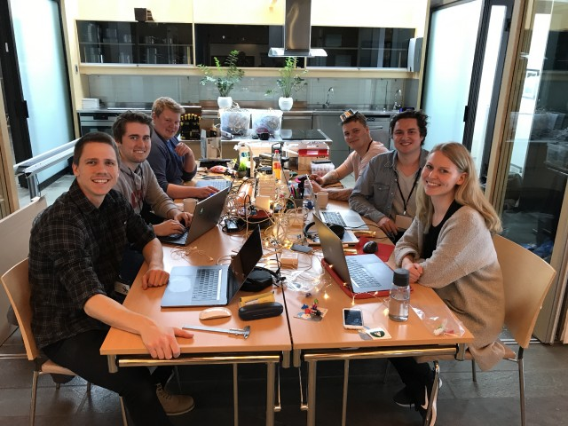

# Great place to workSPACE

Are you tired of free seating? Are you sick of coming to your desk to find everything out of place because someone else has been using it?! Welcome to the greatest place to work(SPACE)!

Our goal is to build a smart workspace that solves all these annoying things about free seating and open office areas, in addition to other helpful features that might come up along the way.

The idea revolves around an electric up/down-desk with an RFID reader. A user can beep their RFID card on the desk and it will automatically adjust the height to your preferred setting, stored in the cloud, using a sensor for measuring the distance to the floor. When you beep your card in and out, the time of your arrival and exit will be logged, which makes registering your hours so much easier!! The desk also has a fan that will automatically start if the temperature drops below a certain level. Here is a sketch of our planned solution:

Our team is from Itera, and consists of 6 members: Thor-Martin, Øyvind, Lars-Erik, Joakim, Kristoffer and Annie (from left to right).

